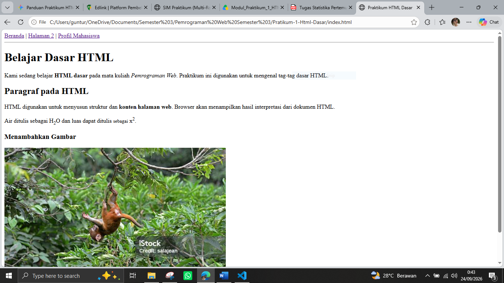
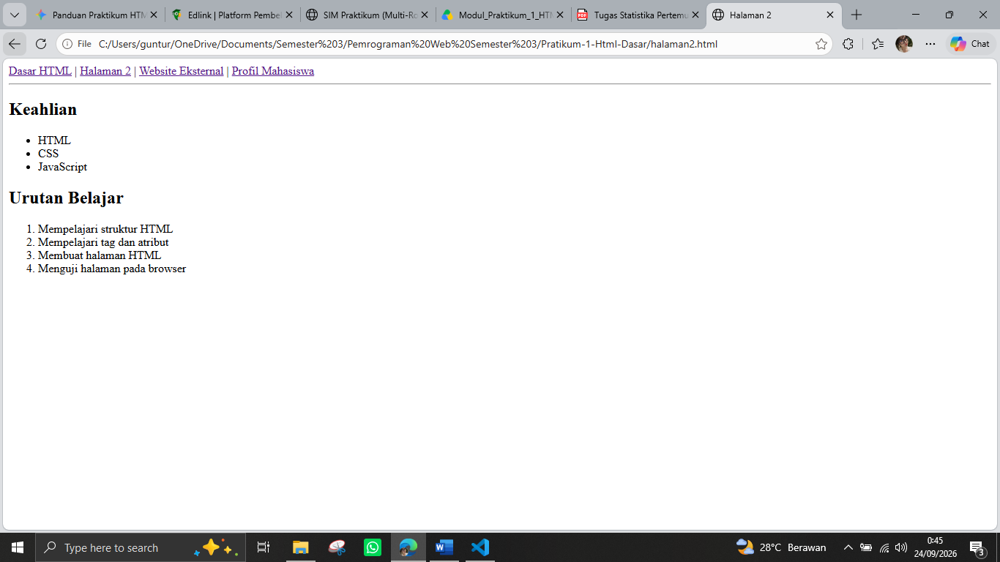
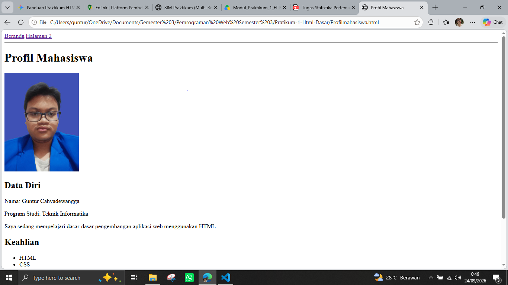

# Laporan Praktikum Web - Lab 1

## Identitas
- **Nama**: [Guntur Cahyadewangga]
- **NIM**: [312510265]

## Jawaban Pertanyaan Teori

1. **Apa fungsi deklarasi `<!DOCTYPE html>` pada dokumen HTML?**  
   Memberi tahu peramban (*browser*) tentang versi HTML yang digunakan (HTML5) agar peramban merender halaman web secara konsisten dalam *standard mode*.

2. **Apa perbedaan antara tag, elemen, dan atribut pada HTML?**  
   - **Tag**: Sintaks berupa tanda kurung sudut pembuka atau penutup (contoh: `
` dan `
`).  
   - **Elemen**: Keseluruhan unit yang mencakup tag pembuka, isi/konten, hingga tag penutup (contoh: `
Teks paragraf
`).  
   - **Atribut**: Informasi tambahan di dalam tag pembuka untuk mengatur sifat/karakteristik elemen (contoh: `src="image/monyet.jpg"`).

3. **Apa perbedaan `
` dengan ` `? Jelaskan penggunaannya.**  
   - `
` (*paragraph*): Digunakan untuk membuat paragraf baru dengan jarak margin otomatis sebelum dan sesudahnya.  
   - ` ` (*line break*): Digunakan untuk berpindah ke baris baru secara langsung di dalam teks tanpa membuat paragraf baru.

4. **Apa fungsi atribut `href` pada tag `<a>`?**  
   Menentukan lokasi tujuan (*URL* atau alur berkas) yang akan dibuka ketika tautan/hyperlink tersebut diklik oleh pengguna.

5. **Apa perbedaan hyperlink ke halaman internal dengan hyperlink ke website eksternal?**  
   - **Internal**: Menghubungkan satu halaman ke halaman lain di dalam folder/proyek yang sama (contoh: `Halaman2.html`).  
   - **Eksternal**: Menghubungkan halaman web ke domain lain di luar situs tersebut (contoh: `https://www.google.com`).

6. **Apa fungsi atribut `src` dan `alt` pada tag ``?**  
   - `src` (*source*): Menentukan lokasi alur berkas atau URL dari gambar yang ingin ditampilkan.  
   - `alt` (*alternate text*): Menyediakan teks pengganti jika gambar gagal dimuat atau untuk membantu alat pembaca layar (*screen reader*).

7. **Apa perbedaan penggunaan `<ul>` dan `<ol>`?**  
   - `<ul>` (*unordered list*): Menampilkan daftar tanpa urutan penomoran, menggunakan simbol (*bullet*).  
   - `<ol>` (*ordered list*): Menampilkan daftar berurutan menggunakan angka atau huruf.

8. **Apa yang terjadi jika path gambar pada atribut `src` salah?**  
   Gambar gagal dimuat dan peramban akan menampilkan ikon gambar pecah (*broken image*) serta memunculkan teks dari atribut `alt`.

9. **Mengapa struktur heading `h1` sampai `h6` perlu digunakan secara terstruktur?**  
   Untuk menjaga hierarki bacaan, membantu pengguna dengan pembaca layar (*screen reader*), serta memudahkan mesin pencari (*SEO*) memahami struktur utama konten.

10. **Apa fungsi komentar `<!-- ... -->` dalam kode HTML?**  
    Memberikan catatan atau penjelasan di dalam kode sumber HTML yang tidak akan ditampilkan oleh peramban di layar web.

## Hasil Praktikum

### 1. Halaman Utama (index.html)

### 2. Halaman Kedua (Halaman2.html)

### 3. Profil Mahasiswa (Profilmahasiswa.html)
